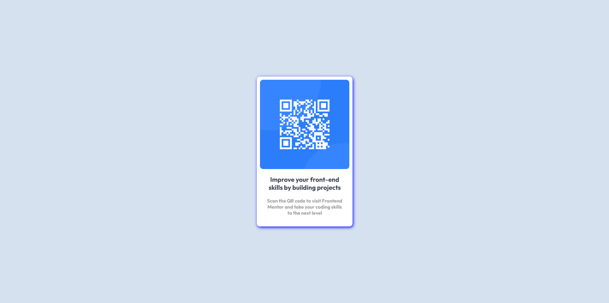

<h1 align="center">CARD DE INFORMACIÓN QR</h1>

El diseño del card es muy llamativo, puede servir como medio publicitario hacia una marca o algún producto. La sombra que tiene de fondo resalta el elemento combinando la estetica del fondo del código QR.

<h2>Herramientas utilizadas<h2>

 
 
 
 

<h2>Version de escritorio</h2>

El card mantiene sus dimensiones en la versión desktop y se mantienen centrado al tamaño de la pantalla del dispositivo.

<h2>version movil</h2>

El card tiene sus propias dimensiones en la versión movil que no se ve alterada por el tamaño del dispositivo.

<h3 align="center">
  
</h3>

